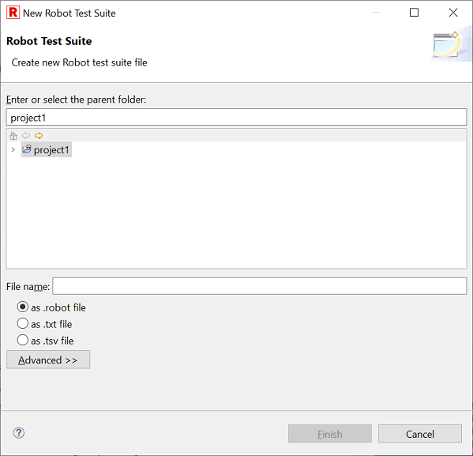
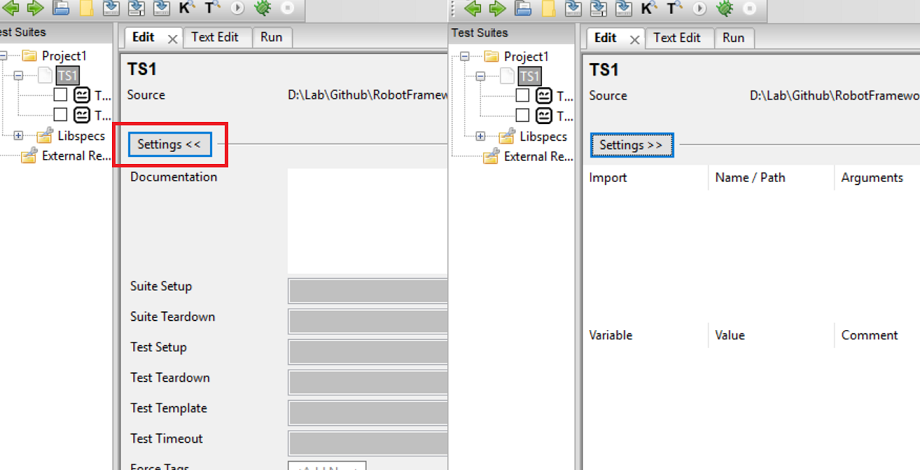
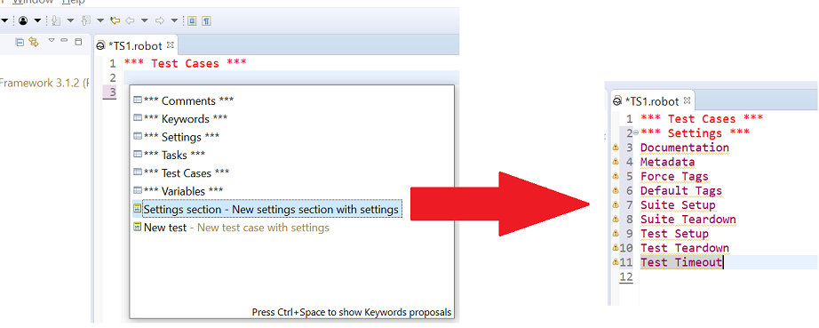

## Section 2


### Lecture 2.1 - Test Suite, Test Cases, User Keywords and Reports

**Test Suite** - As explained in L-1.5, we can create a **Test Suite** under a project. A *test suite*, in general, is a collection of test cases.

A test suite can be saved as .robot file, .txt file or .tsv file. You can follow any one and use it across in your project.



In RIDE, it appears like this


**Test Suite Configuration**

1. Imports
	a. Libraries
	b. Resources
	c. Variables
	
2. Add new
	a. Scalar
	b. List
	c. Dictionary
	d. Metadata
	
3. Settings
	a. Documentation
	b. Suite Setup
	c. Suite Teardown
	d. Test Setup
	e. Test Teardown
	f. Test Template
	g. Test Timeout
	h. Force Tags
	i. Default Tags

Configuring these on RIDE is very easy because its interface is very user friendly.




In RED, you need to go to editor and click Ctrl + Space. When you double click on Settings, all these would pop up.



We will see more details about these later.


**Test Cases** - 

It is absolutely okay, if you do not understand the below code and it's output. Just have a glimpse of how we write test cases in robot framework.

```
*** Test Cases ***

TestCase1 - Celcius to Farenheit
    ${celcius}=    Set Variable    37
    ${Farehneit}=    Evaluate    (${celcius}*9/5)+32
    Log    ${Farehneit}
    
TestCase2 - Celcius to Farenheit in Bulk
    @{celcius}=    Create List    10    12    37    22
    FOR    ${temp}    IN    @{celcius}
        ${Farehneit}=    Evaluate    (${temp}*9/5)+32
        Log    ${Farehneit}
    END
```

### Output logs
```
Starting test: Project1.TS1.TestCase1 - Celcius to Farenheit
20191207 22:41:50.743 : INFO : ${celcius} = 37
20191207 22:41:50.743 : INFO : ${Farehneit} = 98.6
20191207 22:41:50.743 : INFO : 98.6
Ending test: Project1.TS1.TestCase1 - Celcius to Farenheit

Starting test: Project1.TS1.TestCase2 - Celcius to Farenheit in Bulk
20191207 22:41:50.743 : INFO : @{celcius} = [ 10 | 12 | 37 | 22 ]
20191207 22:41:50.743 : INFO : ${Farehneit} = 50.0
20191207 22:41:50.743 : INFO : 50.0
20191207 22:41:50.743 : INFO : ${Farehneit} = 53.6
20191207 22:41:50.743 : INFO : 53.6
20191207 22:41:50.743 : INFO : ${Farehneit} = 98.6
20191207 22:41:50.743 : INFO : 98.6
20191207 22:41:50.743 : INFO : ${Farehneit} = 71.6
20191207 22:41:50.743 : INFO : 71.6
Ending test: Project1.TS1.TestCase2 - Celcius to Farenheit in Bulk
```


**User Keywords** -

User keywords are nothing but Functions if we compare with programming languages. We use functions to make code modular. In the same way, User keywords in robot framework are meant to serve this purpose.

```
*** Test Cases ***
TC1
    Function1
    Run Keyword    Function2    

*** Keywords ***
Function1
    Log    This is a inner function1
    
Function2
    Log    This is a inner function2
```
---------------------------------------------------------------


### Lecture 2.2 - Builtin-Library and keywords

**Local and Global Variables**

**1. Set Variable**
	```
	*** Test Cases ***
	TC1
		${a}=    Set Variable    50
	```

**2. Set Variable If**
	```
	*** Test Cases ***
	TC2
		${a}=    Set Variable If    True==True    50    100
		Log    ${a}
	TC3
		${a}=    Set Variable If    True==False    50    100
		Log    ${a}
	```

**Output:**
```
20191208 23:18:11.433 : INFO : ${a} = 50
20191208 23:18:11.434 : INFO : 50
Ending test: Project1.TS1.TC2

Starting test: Project1.TS1.TC3
20191208 23:18:11.436 : INFO : ${a} = 100
20191208 23:18:11.438 : INFO : 100
```


**3. Set Global Variable**
	```
	TC4 - Set Global Variable
		${a}=    Set Variable    50
		Set Global Variable    ${a}
	```
Now variable a is global and can be used from anywhere throughout the execution.


**Data type/Number system Conversion**
	
**4. Convert To Binary**
	```
	TC5 - Convert To Binary
		${a}=    Set Variable    99
		${b}=    Convert To Binary    ${a}
		Log    ${b}
	```

**Output:**
```
Starting test: Section2.BuiltInFunctions.TC5 - Convert To Binary
20191212 11:48:08.040 : INFO : ${a} = 99
20191212 11:48:08.041 : INFO : ${b} = 1100011
20191212 11:48:08.042 : INFO : 1100011
```

**5. Convert To Boolean**
This function is use to handle case-sensitive true and false and conver to a boolean value.
```
TC6 - Convert To Boolean
    ${a}=    Set Variable    tRuE
    ${b}=    Convert To Boolean    ${a}
    Log    ${b}
```

```
Starting test: Section2.BuiltInFunctions.TC6 - Convert To Boolean
20191212 11:54:59.294 : INFO : ${a} = tRuE
20191212 11:54:59.294 : INFO : ${b} = True
20191212 11:54:59.295 : INFO : True
```

**6. Convert To Bytes**
```
TC7 - Convert To Bytes
    ${b}=    Convert To Bytes    75 65 77 65 76     int
    Log    ${b}
```

**Output:**
```
20191212 12:10:24.323 : INFO : ${b} = KAMAL
20191212 12:10:24.324 : INFO : KAMAL
```

**7. Convert To Hex**
```
TC8 - Convert To Hex
    ${b}=    Convert To Hex    100    10
    ${b}=    Convert To Hex    100    8
```    


**Output:**
```
20191212 12:14:56.941 : INFO : ${b} = 64
20191212 12:14:56.941 : INFO : ${b} = 40
```

**8. Convert To Integer**
```
TC9 - Convert To Integer
    ${b}=    Convert To Integer    FF    16
	${b}=    Convert To Integer   100    8
```

**Output:**
```
20191212 12:16:10.501 : INFO : ${b} = 255
```

**9. Convert To Number**
```
TC10 - Convert To Number
    ${b}=    Convert To Number    41.111    1
```

**Output:**
```
20191212 13:09:03.088 : INFO : ${b} = 41.1
```

**10. Convert To Octal**
```
TC11 - Convert To Octal
    ${b}=    Convert To Octal    111    2
```

**Output:**
```
20191212 13:10:54.408 : INFO : ${b} = 7
```

**11. Convert To String**
